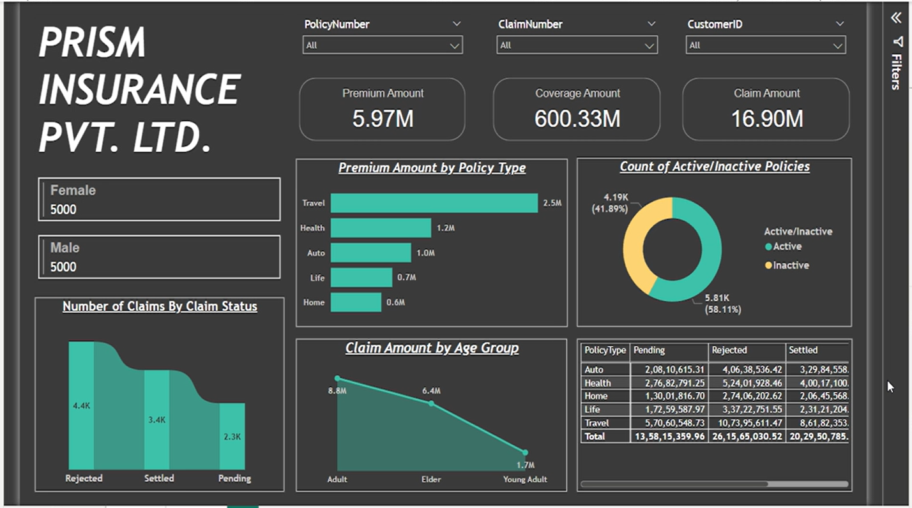
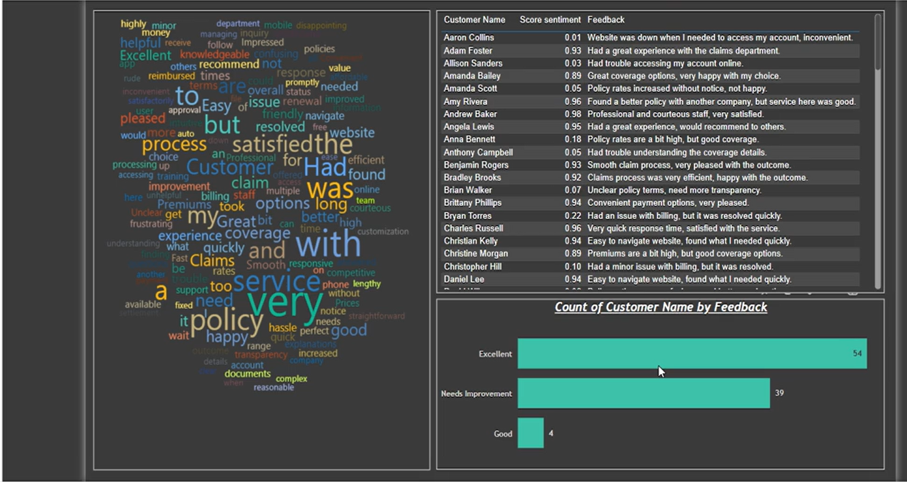

# Pizzeria Data Analysis | MySQL, Power BI

## Project Overview
This project involves the development of a comprehensive SQL database and data analysis dashboard for a Pizzeria business. The goal was to enhance the portfolio with hands-on experience in SQL database design, data manipulation, and the integration of Business Intelligence (BI) tools for interactive data visualization.

### Key Objectives
- **SQL Database Design**: Designed and developed a relational database to track customer orders, stock levels, and staff details.
- **Data Extraction & Analysis**: Utilized advanced SQL queries to extract actionable insights from the database, including aggregations, calculations, and table joins.
- **Power BI Integration**: Integrated the SQL database with Power BI to create interactive dashboards that help visualize and interpret the data for decision-making.

## Dataset
This project uses a simulated dataset for analysis. The dataset provides detailed records on customer orders, feedback, and other related business metrics. You can access and explore the following datasets used for analysis:

- **Insurance Customer Feedback (Excel)**: [Insurance-Customer-Feedback.xlsx](https://github.com/m0hit5/Insurance-Data-Analysis/blob/main/Insurance-Customer-Feedback.xlsx)
- **Insurance Data (CSV)**: [InsuranceData.csv](https://github.com/m0hit5/Insurance-Data-Analysis/blob/main/InsuranceData.csv)

## Features
### SQL Database
- **Customer Orders**: Stores details of orders made by customers including order IDs, customer details, order items, and order date.
- **Stock Levels**: Tracks inventory and product stock levels to manage supplies effectively.
- **Staff Information**: Includes data on employees such as names, roles, and shift details to ensure smooth operations.

### SQL Queries
- **Aggregations**: Queries were created to calculate metrics such as total sales, orders per staff, and average order size.
- **Table Joins**: Used joins to link customer, order, and staff data to provide a complete view of the business operations.
- **Data Manipulation**: Wrote custom queries to analyze order trends, calculate stock consumption, and evaluate employee performance.

### Power BI Dashboard
The Power BI dashboard was created to provide a clear and interactive visualization of the data. The dashboard features:
- **Order Trends**: Visualizes daily, weekly, and monthly order trends.
- **Stock Overview**: Displays stock levels and highlights products in need of replenishment.
- **Staff Performance**: Provides insights into staff performance and order fulfillment times.

## Images
The following images showcase key insights from the Power BI dashboard:

- 
- 

## Installation Instructions
### Prerequisites
- MySQL Database (or any compatible SQL database)
- Power BI Desktop

### Steps
1. **Clone the Repository**
   ```bash
   git clone https://github.com/yourusername/pizzeria-data-analysis.git
